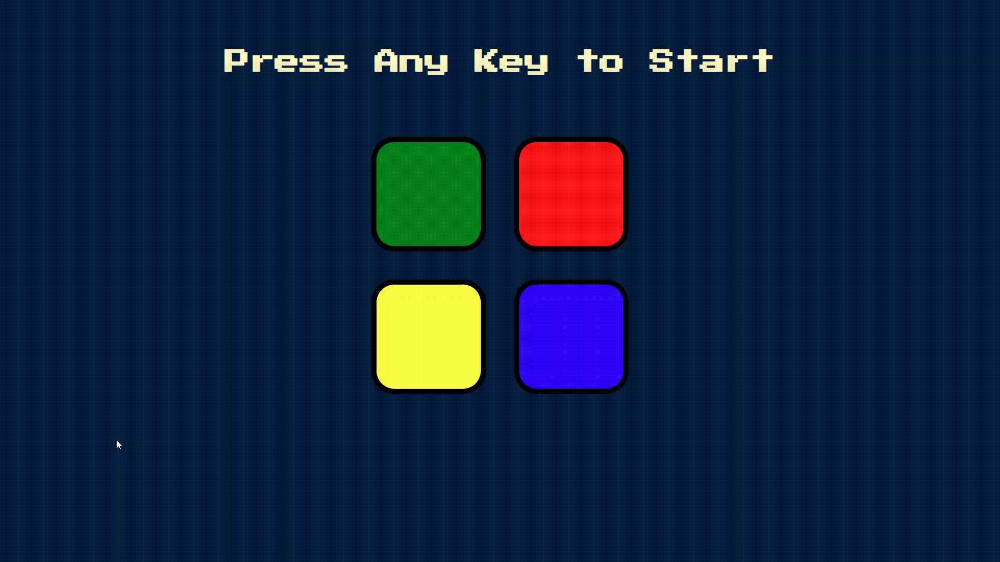

<h1 align="center">
  

Simon Memory Game

</h1>

<h4 align="center">
  A web app for interactively playing the classic game, Simon, in the browser. Try and see how good of a memory you have based on which level you make it to.
</h4>

<h4 align="center">Click <a href="https://zeekcollins.github.io/SimonGameChallenge/">here</a> to play the game.</h4>
 

## :warning: Notice

All the resources and assets used in the app are not my property. All resources/assets are from flaticon, google images, youtube, etc. The rights are reserved to the designer of each resource. If you have any problem with me using your resources, please contact me. Thanks!

## :eyes: Visuals

  

## :exclamation: About

Simon is a simple app I made while learning Javascript. I've learned a lot more since then, but at the time of building this game, the process taught me a great amount. This app is an in-browser version of the physical simon memory game popularized in the 80's.

## :rocket: Technologies

This project was developed with the following technologies:

- Javascript
- CSS
- HTML

## :running: Play

If you would like to test it out, click [here](https://zeekcollins.github.io/SimonGameChallenge/) to give it a go.

Made with ♥ by Zeek Collins :wave: [Get in touch!](https://www.linkedin.com/in/ezekialcollinsii/)
